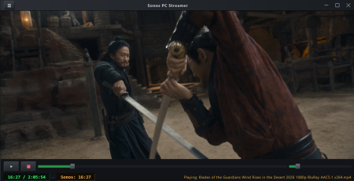

# SonosPCstreamer
Simple tool to watch videos with audio going to Sonos speakers 

I made this tool after [my YT streamer](https://github.com/Kilvoctu/SonosYTstreamer), mainly meant for watching video files. I ended up adding some YT functions into it though. This is a quickly made tool for personal use, don't expect anything polished or even fully functional.

### Setup
- Have Python 3.10 at least
- Know your speaker IP address
- Run `run.bat`. It will set up the .env, create a local Python environment, download ffmpeg and mpv, then run the app.

### Usage
- Run `run.bat`.
- Open `≡` menu
- Browse to a video file or paste a YT link 
- Check audio track, etc.
- Click play.

### Features
- Supports multiple speakers (one speaker is designated as the coordinator).
- Supports most video files, online content and live streams (anything that's support by yt-dlp).
- A/V syncs by subtly adjusting video speed until it's synced.
- Set manual video delay to help sync.
- Select audio tracks and subtitles.
- Seek timestamp and change volume.
- Supports SDR/HDR

### Known issues and other things
- Features may randomly not work (playback, seeking, color space, etc.).
- Audio takes a while to sync.
- Doesn't play age-restricted YT content.
- Probably a bunch of bugs I haven't caught or tested for.
- Only tested on a pair of Sonos One with an HDR display.
